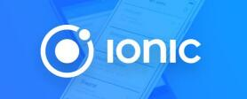

# Ionic Framework Tutorial.《跟老卫学Ionic》 

		

Ionic Framework Tutorial takes you to learn Ionic Framework step by step with a large number of samples. There is also a GitBook version of the book: <http://www.gitbook.com/book/waylau/ionic-framework-tutorial>.
Let's [READ](SUMMARY.md)!

《跟老卫学Ionic》是一本关于 Ionic Framework 学习的开源书。利用业余时间写了本书，图文并茂，用大量实例带你一步一步走进 Ionic Framework 的世界。如有疏漏欢迎指正，欢迎提问。感谢您的参与！

Ionic 致力于帮助开发人员构建和发布漂亮的跨平台混合应用程序（hybrid app）。

Ionic 与 Angular 有着一流的集成。如果对Angular感兴趣，可以参阅笔者所著的《[跟老卫学Angular](https://github.com/waylau/angular-tutorial)》。

## 涉及技术

本书涉及的相关技术及版本如下。

* Visual Studio Code 1.31.1 
* Node.js 11.10.0
* npm 6.7.0
* Ionic Framework 6.1.5

 
## Get Started 如何开始阅读

选择下面入口之一：

* <https://github.com/waylau/ionic-framework-tutorial/> 的 [SUMMARY.md](SUMMARY.md)（源码）
* <http://waylau.gitbooks.io/ionic-framework-tutorial/> 点击 Read 按钮（同步更新，国内访问速度一般）
* <https://gitee.com/waylau/ionic-framework-tutorial> 的 [SUMMARY.md](SUMMARY.md)（码云，手动同步，有所延时）

## Code 源码

书中所有示例源码，移步至<https://github.com/waylau/ionic-framework-samples>  `samples` 目录下：

## Issue 意见、建议

如有勘误、意见或建议欢迎拍砖 <https://github.com/waylau/ionic-framework-tutorial/issues>

## 联系作者:

您也可以直接联系我：

* 博客：https://waylau.com
* 邮箱：[waylau521(at)gmail.com](mailto:waylau521@gmail.com)
* 微博：http://weibo.com/waylau521
* 开源：https://github.com/waylau

## 其他书籍

若您对本书不感冒，笔者还写了其他方面的超过一打的书籍（可见<https://waylau.com/books/>），多是开源电子书。

本人也维护了一个[books-collection](https://github.com/waylau/books-collection)项目，里面提供了优质的专门给程序员的开源、免费图书集合。

二手书集市（<https://github.com/waylau/second-hand-books>），提供优质二手书交易。

## 开源捐赠

捐赠所得所有款项将用于开源事业！
