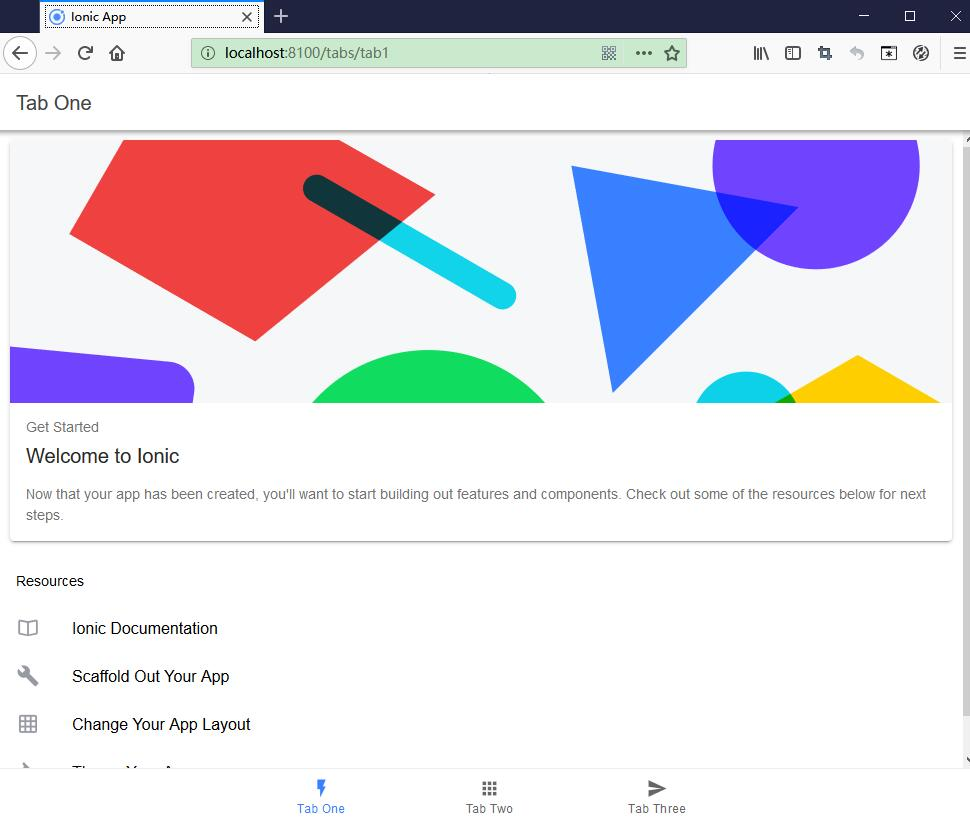
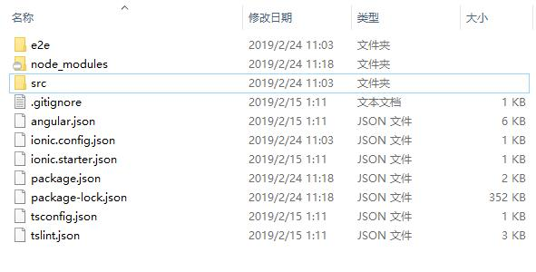

# Hello World

## 创建应用程序

使用其中一个预制的应用模板创建一个Ionic应用，或者使用blank应用模板重新开始。 三个最常见的启动器是blank（空白）启动器，tabs启动器和sidemenu（侧面菜单）启动器。 

下面例子是使用ionic start命令来创建第一个tabs启动器的Ionic应用：

```
$ ionic start hello-world tabs
```

其中，“hello-world”是我们指定的应用的名称。


安装过程如下：

```
ionic start hello-world tabs
[INFO] Existing git project found (D:/workspaceGithub/ionic-framework-tutorial). Git operations are disabled.
√ Preparing directory .\hello-world - done!
√ Downloading and extracting tabs starter - done!

Installing dependencies may take several minutes.

     *   IONIC  DEVAPP   *

 Speed up development with the Ionic DevApp, our fast, on-device testing mobile app

  -     Test on iOS and Android without Native SDKs
  -     LiveReload for instant style and JS updates

 -->    Install DevApp: https://bit.ly/ionic-dev-app    <--

────────────────────────────────────────────────────────────

> npm i
npm WARN deprecated istanbul@0.4.5: This module is no longer maintained, try this instead:
npm WARN deprecated   npm i nyc
npm WARN deprecated Visit https://istanbul.js.org/integrations for other alternatives.
npm WARN deprecated circular-json@0.5.9: CircularJSON is in maintenance only, flatted is its successor.
```

当提示是否安装Ionic Appflow时，可以按自己的意愿来输入“y”或者“n”：

```

     *   IONIC  APPFLOW   *

 Supercharge your Ionic development with the Ionic Appflow SDK

  -    Push remote updates and skip the app store queue

 Learn more about Ionic Appflow: https://ion.link/appflow

────────────────────────────────────────────────────────────

? Install the free Ionic Appflow SDK and connect your app? (Y/n)
```

如果安装了Ionic Appflow，则安装期间还会要求输入Appflow用户名和密码：

```
> ionic link --name hello-world
Log into your Ionic Appflow account

If you don't have one yet, create yours by running: ionic signup
? Email: 778907484@qq.com
? Password: **********
? What would you like to do? (Use arrow keys)
> Link an existing app on Ionic Appflow
  Create a new app on Ionic Appflow
```

Ionic的账号密码，可以在官网<https://ionicframework.com>免费注册。

## 运行应用程序

大多数Ionic应用程序开发都可以使用ionic serve命令来启动应用：

```
$ cd hello-world
$ ionic serve
```

从输出内容可以看到，ionic serve底层也是调用了Angular的命令：

```
ionic serve
> ng run app:serve --host=0.0.0.0 --port=8100
[ng] WARNING: This is a simple server for use in testing or debugging Angular applications
[ng] locally. It hasn't been reviewed for security issues.
[ng] Binding this server to an open connection can result in compromising your application or
[ng] computer. Using a different host than the one passed to the "--host" flag might result in
[ng] websocket connection issues. You might need to use "--disableHostCheck" if that's the
[ng] case.

[INFO] Development server running!

       Local: http://localhost:8100
       External: http://192.168.1.101:8100

       Use Ctrl+C to quit this process

[INFO] Browser window opened to http://localhost:8100!

[ng] i ｢wdm｣: wait until bundle finished: /
[ng] Date: 2019-02-24T03:37:49.680Z
[ng] Hash: 0be1008ebf7b27192e81
[ng] Time: 12912ms
[ng] chunk {common} common.js, common.js.map (common) 18.5 kB  [rendered]
[ng] chunk {main} main.js, main.js.map (main) 32.1 kB [initial] [rendered]
[ng] chunk {polyfills} polyfills.js, polyfills.js.map (polyfills) 237 kB [initial] [rendered]
[ng] chunk {runtime} runtime.js, runtime.js.map (runtime) 8.9 kB [entry] [rendered]
[ng] chunk {styles} styles.js, styles.js.map (styles) 79.5 kB [initial] [rendered]
[ng] chunk {tab1-tab1-module} tab1-tab1-module.js, tab1-tab1-module.js.map (tab1-tab1-module) 6.39 kB  [rendered]
[ng] chunk {tab2-tab2-module} tab2-tab2-module.js, tab2-tab2-module.js.map (tab2-tab2-module) 4.52 kB  [rendered]
[ng] chunk {tab3-tab3-module} tab3-tab3-module.js, tab3-tab3-module.js.map (tab3-tab3-module) 4.52 kB  [rendered]
[ng] chunk {tabs-tabs-module} tabs-tabs-module.js, tabs-tabs-module.js.map (tabs-tabs-module) 7.55 kB  [rendered]
[ng] chunk {vendor} vendor.js, vendor.js.map (vendor) 4.35 MB [initial] [rendered]
[INFO] ... and 173 additional chunks
[ng] i ｢wdm｣: Compiled successfully.
```


访问页面<http://localhost:8100>，可以看到应用的效果，如下图：




在浏览器里面，使用“响应式设计模式”，可以看到应用在移动设备里面的运行效果：


观察应用的结构，可以发现与Angular应用的结构是非常类似的。


