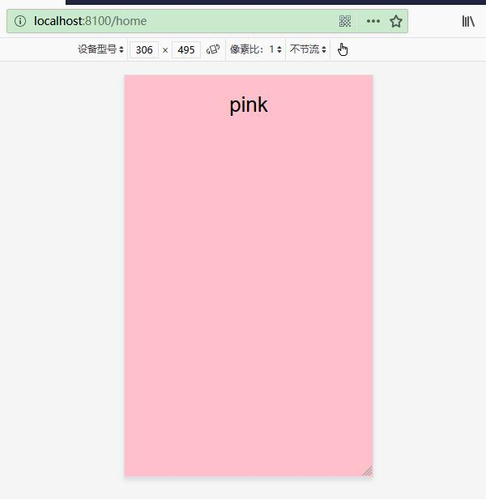
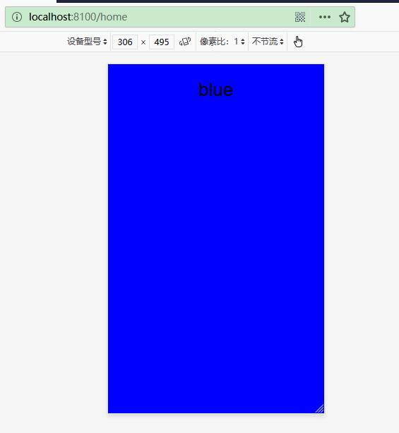

# ion-slides 实现滑动效果

ion-slides 实现滑动主要基于[Swiper](http://idangero.us/swiper)来实现的。
创建ion-slides应用：

```
$ ionic start ion-slides
```


启动应用：


```
$ cd ion-slides
$ ionic serve
```


## 修改模版

修改模版代碼如下：

```
<ion-slides [options]="slideOpts">
  <ion-slide>
    <div class="box pink">
      <h1>pink</h1>
    </div>
  </ion-slide>
  <ion-slide>
    <div class="box yellow">
      <h1>yellow</h1>
    </div>
  </ion-slide>
  <ion-slide>
    <div class="box blue">
      <h1>blue</h1>
    </div>
  </ion-slide>
</ion-slides>
```


这里用到了Ionic 的ion-slides 和 ion-slide组件。
其中，slideOpts用到了组件里面的参数对象。


## 修改组件


修改组件代碼如下：

```ts
import { Component } from '@angular/core';

@Component({
  selector: 'app-home',
  templateUrl: 'home.page.html',
  styleUrls: ['home.page.scss'],
})
export class HomePage {
  // slide选项
  slideOpts = {
    effect: 'flip'  //滑动效果
  };
  constructor() { }
}
```


effect定义了滑动效果。effect可以设置的值卫slide、fade、cube、coverflow 和 flip。具体可以参考[Swiper API](http://idangero.us/swiper/api/)。

## 修改样式

修改样式如下：


```scss
.blue {
    background-color: blue;
}

.yellow {
    background-color: yellow;
}

.pink {
    background-color: pink;
}

.box {
    height: 100%;
    width: 100%;
}

ion-slides {
    height: 100%;
    margin: 0 0 0 0;
}
```

## 运行应用

运行应用，水平滑动效果如下：





