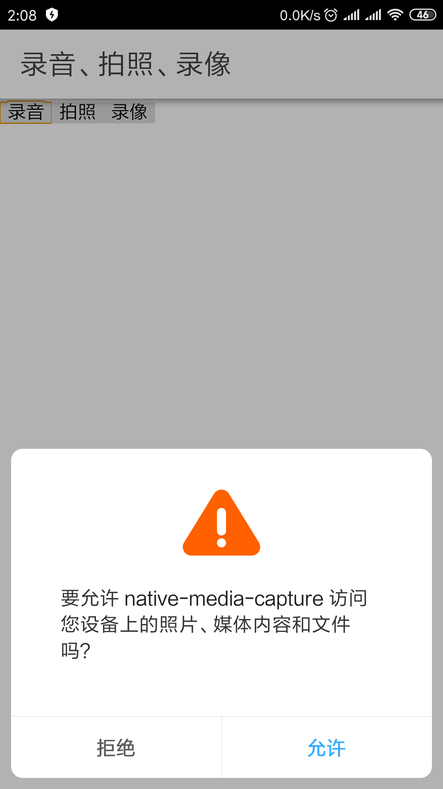
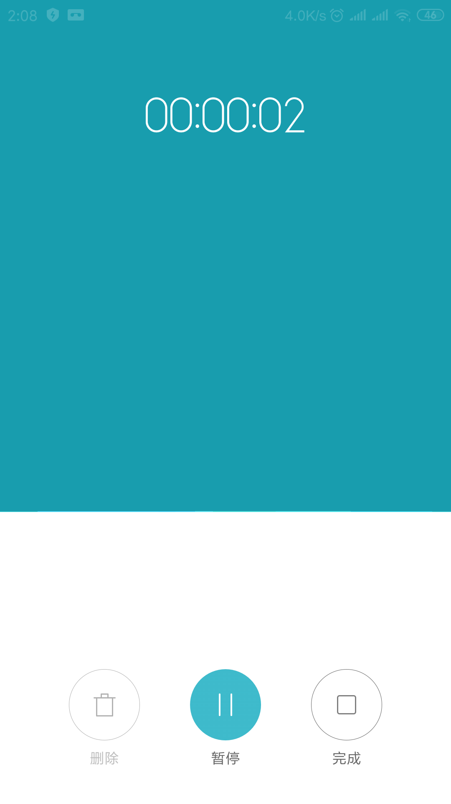
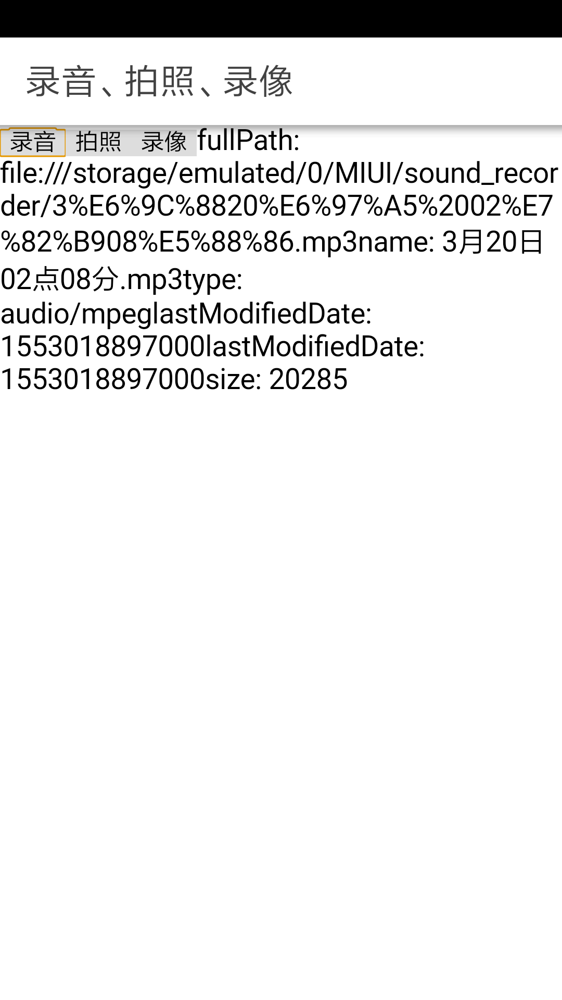
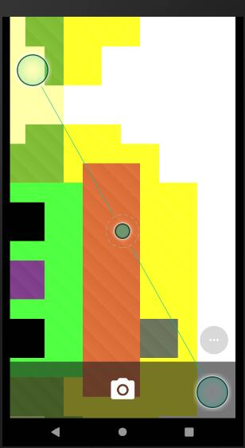
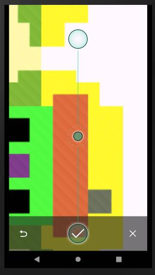
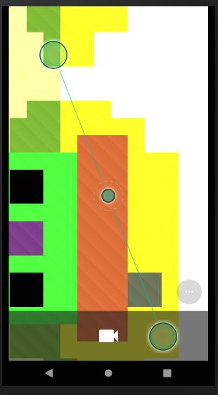
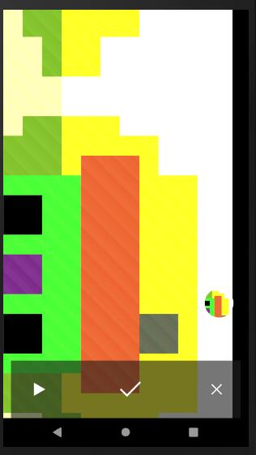

# 录音、拍照、录像

借助  `cordova-plugin-media-capture` 插件，可以实现利用移动设备来录音、拍照、录像。

插件介绍见<https://github.com/apache/cordova-plugin-media-capture>。


## 初始化应用

```
ionic start native-media-capture blank --cordova
```

其中`native-media-capture`是我们自定义的应用名称。`--cordova`指定了项目将集成 Cordova 框架。
有关 Cordova 内容，可以查阅《Apache Cordova 开发指南》（<https://github.com/waylau/cordova-dev-guide>）。


使用`ionic serve`来验证应用是否可以正常启动。


## 安装插件

```
ionic cordova plugin add cordova-plugin-media-capture

npm install @ionic-native/media-capture
```


## 实现录音

添加组件

```html
<button class="button button-dark" (click)="captureAudio()">录音</button>
```

captureAudio 方法定义如下：

```ts
import { Component } from '@angular/core';
import { MediaCapture, MediaFile, CaptureError, CaptureAudioOptions} from '@ionic-native/media-capture/ngx';

@Component({
  selector: 'app-home',
  templateUrl: 'home.page.html',
  styleUrls: ['home.page.scss'],
})
export class HomePage {

  msg: string = "";

  constructor(private mediaCapture: MediaCapture) { }

  captureAudio() {
    let options: CaptureAudioOptions = { limit: 1 };// 连续录制的次数
    this.mediaCapture.captureAudio(options)
      .then(
        (mediaFiles: MediaFile[]) => {
          for (let i = 0, len = mediaFiles.length; i < len; i++) {
            let fullPath = mediaFiles[i].fullPath;
            let name = mediaFiles[i].name;
            let type = mediaFiles[i].type;
            let lastModifiedDate = mediaFiles[i].lastModifiedDate;
            let size = mediaFiles[i].size;

            console.log("fullPath: " + fullPath);
            console.log("name: " + name);
            console.log("type: " + type);
            console.log("lastModifiedDate: " + lastModifiedDate);
            console.log("lastModifiedDate: " + lastModifiedDate);
            console.log("size: " + size);

            this.msg = "fullPath: " + fullPath +
              "name: " + name +
              "type: " + type +
              "lastModifiedDate: " + lastModifiedDate +
              "lastModifiedDate: " + lastModifiedDate +
              "size: " + size;

          }
        }),
      (err: CaptureError) => {
        console.error(err);
        this.msg = "Camera issue" + err;
      }
      ;
  }


}
```

运行效果如下：








## 实现拍照

添加组件

```html
<button class="button button-dark" (click)="captureImage()">拍照</button>
```

captureImage 方法定义如下：

```ts
import { Component } from '@angular/core';
import { MediaCapture, MediaFile, CaptureError, CaptureImageOptions } from '@ionic-native/media-capture/ngx';

@Component({
  selector: 'app-home',
  templateUrl: 'home.page.html',
  styleUrls: ['home.page.scss'],
})
export class HomePage {

  msg: string = "";

  constructor(private mediaCapture: MediaCapture) { }

  captureImage() {
    let options: CaptureImageOptions = { limit: 1 };// 连续录制的次数
    this.mediaCapture.captureImage(options)
      .then(
        (mediaFiles: MediaFile[]) => {
          for (let i = 0, len = mediaFiles.length; i < len; i++) {
            let fullPath = mediaFiles[i].fullPath;
            let name = mediaFiles[i].name;
            let type = mediaFiles[i].type;
            let lastModifiedDate = mediaFiles[i].lastModifiedDate;
            let size = mediaFiles[i].size;

            console.log("fullPath: " + fullPath);
            console.log("name: " + name);
            console.log("type: " + type);
            console.log("lastModifiedDate: " + lastModifiedDate);
            console.log("lastModifiedDate: " + lastModifiedDate);
            console.log("size: " + size);

            this.msg = "fullPath: " + fullPath +
              "name: " + name +
              "type: " + type +
              "lastModifiedDate: " + lastModifiedDate +
              "lastModifiedDate: " + lastModifiedDate +
              "size: " + size;

          }
        }),
      (err: CaptureError) => {
        console.error(err);
        this.msg = "Camera issue" + err;
      }
      ;
  }


}
```

运行效果如下：






## 实现录像

添加组件

```html
<button class="button button-dark" (click)="captureVideo()">录像</button>
```

captureVideo 方法定义如下：

```ts
import { Component } from '@angular/core';
import { MediaCapture, MediaFile, CaptureError, CaptureVideoOptions } from '@ionic-native/media-capture/ngx';

@Component({
  selector: 'app-home',
  templateUrl: 'home.page.html',
  styleUrls: ['home.page.scss'],
})
export class HomePage {

  msg: string = "";

  constructor(private mediaCapture: MediaCapture) { }
 
  captureVideo() {
    let options: CaptureVideoOptions = { limit: 1 };// 连续录制的次数
    this.mediaCapture.captureVideo(options)
      .then(
        (mediaFiles: MediaFile[]) => {
          for (let i = 0, len = mediaFiles.length; i < len; i++) {
            let fullPath = mediaFiles[i].fullPath;
            let name = mediaFiles[i].name;
            let type = mediaFiles[i].type;
            let lastModifiedDate = mediaFiles[i].lastModifiedDate;
            let size = mediaFiles[i].size;

            console.log("fullPath: " + fullPath);
            console.log("name: " + name);
            console.log("type: " + type);
            console.log("lastModifiedDate: " + lastModifiedDate);
            console.log("lastModifiedDate: " + lastModifiedDate);
            console.log("size: " + size);

            this.msg = "fullPath: " + fullPath +
              "name: " + name +
              "type: " + type +
              "lastModifiedDate: " + lastModifiedDate +
              "lastModifiedDate: " + lastModifiedDate +
              "size: " + size;

          }
        }),
      (err: CaptureError) => {
        console.error(err);
        this.msg = "Camera issue" + err;
      }
      ;
  }

}
```

运行效果如下：






